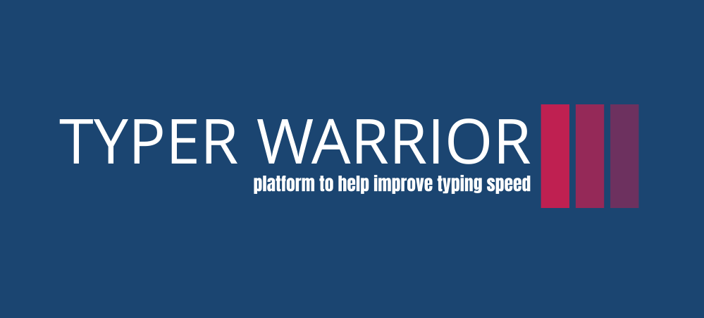
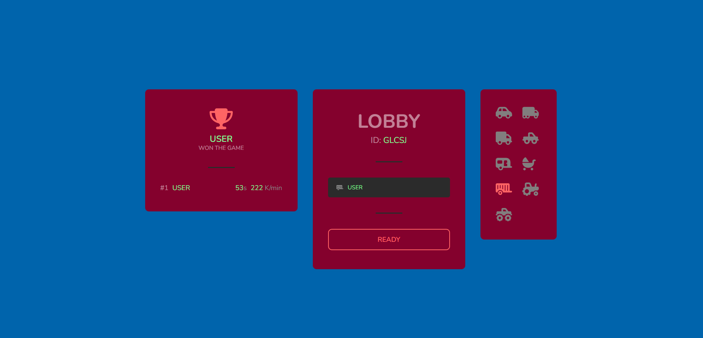

<br/>
<p align="center">
  <a href="https://github.com/adityaRajGit/Typer-Warrior">
    
  </a>

  <h3 align="center">Typing Warrior</h3>

  <p align="center">
    A typing game where different players compete each other.
    <br/>
    <br/>
    <a href="https://github.com/adityaRajGit/Typer-Warrior/issues">Report Bug</a>
    .
    <a href="https://github.com/adityaRajGit/Typer-Warrior/issues">Request Feature</a>
  </p>
</p>

    

## Table Of Contents

* [About the Project](#about-the-project)
* [Built With](#built-with)
* [Getting Started](#getting-started)
  * [Prerequisites](#prerequisites)
  * [Installation](#installation)
* [Roadmap](#roadmap)
* [Contributing](#contributing)
* [License](#license)
* [Authors](#authors)
* [Acknowledgements](#acknowledgements)

## About The Project



Speed Typing Game Application Create a Speed Typing game application where players can practice and compete against each other.

Practice/Solo Mode: • A game mode for player to practice and improve their typing skills. • Player can choose the level of difficulty and game duration. • Player can visualize the typed text progress and real-time typing speed. • Once the game ends, the results (e.g., accuracy and typing speed) will be shown to the player.

Multi-Player Mode: • A game mode to test your skills against other speedsters. • Player can choose the level of difficulty and will be put in a lobby with other players who choose the same difficulty. • In a particular lobby, all players are shown the same paragraph as the typing challenge. • In addition to the player's personal progress, they can also visualize other players' progress. • On game end, the results (e.g., accuracy, typing speed and lobby rank of each player) of all the players in the lobby will be displayed.


## Built With

* Socket.io
 
* React.js

* Express.js

* Node.js

## Getting Started

This is an example of how you may give instructions on setting up your project locally.
To get a local copy up and running follow these simple example steps.

### Prerequisites

This is an example of how to list things you need to use the software and how to install them.

* npm

```sh
npm install npm@latest -g
```

### Installation

1. Clone the repo

```sh
git clone https://github.com/adityaRajGit/Typer-Warrior.git
```

2. Install NPM packages in both backend and frontend part of project

```sh
npm install
```

3. Run the Backend and Frontend part of the code by using 

```sh
npm start
```


## Roadmap

See the [open issues](https://github.com/adityaRajGit/Typer-Warrior/issues) for a list of proposed features (and known issues).

## Contributing

Contributions are what make the open source community such an amazing place to be learn, inspire, and create. Any contributions you make are **greatly appreciated**.
* If you have suggestions for adding or removing projects, feel free to [open an issue](https://github.com/adityaRajGit/Typer-Warrior/issues/new) to discuss it, or directly create a pull request after you edit the *README.md* file with necessary changes.
* Please make sure you check your spelling and grammar.
* Create individual PR for each suggestion.
* Please also read through the [Code Of Conduct](https://github.com/adityaRajGit/Typer-Warrior/blob/main/CODE_OF_CONDUCT.md) before posting your first idea as well.

### Creating A Pull Request

1. Fork the Project
2. Create your Feature Branch (`git checkout -b feature/AmazingFeature`)
3. Commit your Changes (`git commit -m 'Add some AmazingFeature'`)
4. Push to the Branch (`git push origin feature/AmazingFeature`)
5. Open a Pull Request

## License

Distributed under the MIT License. See [LICENSE](https://github.com/adityaRajGit/Typer-Warrior/blob/main/LICENSE.md) for more information.

## Authors

* **Shashank Singh** - *BIT MESRA EEE Student* - [Shashank Singh](https://github.com/shashankkrs) - *Timing Feature , Lobby Generator*
* **Aditya Raj** - *BIT MESRA EEE Student* - [Aditya Raj](https://github.com/adityaRajGit) - *Multiplayer Lobby , Automotive UI  *
